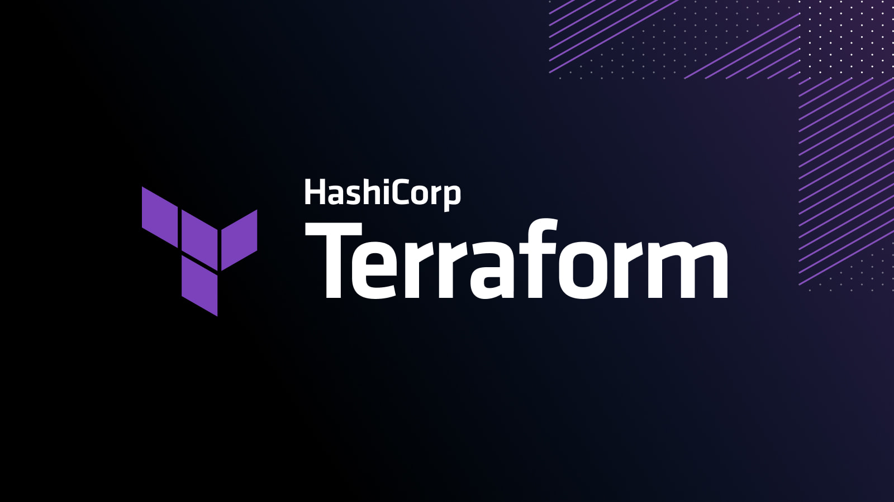

### Guide on Installing and Utilizing Terraform on a Linux System

Terraform, a widely acclaimed cloud orchestration tool, is not only free and open-source but also revered for its role in "Infrastructure as Code" due to its capacity to deploy infrastructure through code. This technology is the brainchild of HashiCorp and is distributed under the Mozilla Public License. It boasts compatibility with numerous cloud providers, such as AWS, Azure Cloud, GCP, Oracle Cloud, and more. Terraform empowers you to construct, modify, and version your infrastructure securely and efficiently. Furthermore, Terraform streamlines the provisioning and management of resources, encompassing Virtual Machines, Storage, Networking, and Databases, all achieved through machine-readable definition files.



#### Key Attributes

1. Open-source and free of charge.
2. User-friendly, lightweight, and straightforward.
3. Adopts a declarative syntax.
4. Supports pluggable modules.
5. Enforces immutable infrastructure.

This article elucidates the process of installing and harnessing Terraform on a Linux-based system.

#### Prerequisites
1. A Linux-based server is up and running.
2. A root password has been configured for your server.

### Install Terraform on Linux

By default, Terraform is not included in the Ubuntu or CentOS default repository, so you will need to install it from their official repository.

#### For Ubuntu and Debian based distributions

1. First, install the required dependencies using the following command:

    ```
    apt-get install software-properties-common gnupg2 -y
    ```

2. Next, import the Terraform key with the following command:

    ```
    curl -fsSL https://apt.releases.hashicorp.com/gpg | apt-key add -
    ```

3. Add the Terraform repository using the following command:

    ```
    apt-add-repository "deb [arch=$(dpkg --print-architecture)] https://apt.releases.hashicorp.com $(lsb_release -cs) main"
    ```

4. Once the repository is added, update the repository and install Terraform using the following command:

    ```
    apt-get update -y
    apt-get install terraform -y
    ```

5. After installing Terraform, verify the installed version with the following command:

    ```
    terraform --version
    ```

   You should get the following output: **Terraform v1.6.1 on linux_amd64**


#### For CentOS and RHEL based distributions

1. First, install required tools using the following command:

 ```
 yum install yum-utils -y
 ```

2. Add the Terraform repository using the following command:

 ```
 yum-config-manager --add-repo https://rpm.releases.hashicorp.com/RHEL/hashicorp.repo
 ```

3. Once the repository is added, update the repository and install Terraform using the following command:

 ```
 yum update
 yum install terraform
 ```

4. After installing Terraform, verify the Terraform version with the following command:

 ```
 terraform --version
 ```

You should get the following output: **Terraform v1.6.1 on linux_amd64**


